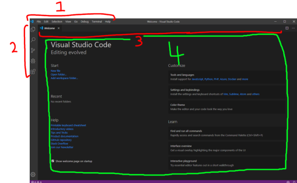
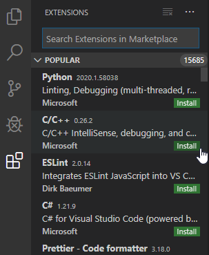

# 0.1 - The Code Editor

Watching professional programmers is pretty intimidating. They have expensive keyboards and multiple monitors, some which may be mounted sideways (*sideways!*), and on every screen there's lines upon lines of text, some in small windows, some in large windows. Well fear not, for these programmers are simply using a very scaled up version of the Notepad program that comes with Windows.

We're also going to be using a scaled up version of Notepad. In comparison to some of these tools, it's really quite simple, but it does its job remarkably well. It's a plain text editor called Visual Studio Code.

## Setting up Visual Studio Code

Head over to [https://code.visualstudio.com/](https://code.visualstudio.com), and press the big Download button in the center of the page. It's from Microsoft, so you know you're not getting any scary viruses. Once that's done, **install it, accepting all the defaults, and launch the program.** You'll see a screen that looks like this.

1. Title Bar
    - Has a bunch of main functions and settings
2. Activity Bar
    - Contains different views to assist you while working on your project. In order, they are:
    1. Explorer
    2. Search
    3. Source Control
    4. Debug and Run
    5. Extensions

3. Editor Tabs
    - Holds tabs for each of your open editors. These are much like the tabs in your web browser.
4. Main editing window
    - The contents of the file you have open will be here.

There's other elements, but we'll get to them as we get there. For now, there's a few things we need to set up.

  

Click on the Extensions button in the Activity Bar (it's the last one). A window should pop up that looks like this.

The C/C++ extension by Microsoft should appear in the list. If it doesn't, type "c++" into the search box right above it. Click its' little green `install` button. This gives VS Code the ability to read our code and put squiggly red lines underneath bits that are wrong.

That's all we need to do with VS Code for now. We'll install more extensions as we go.

## [Next Page](0.2.Compiler)
