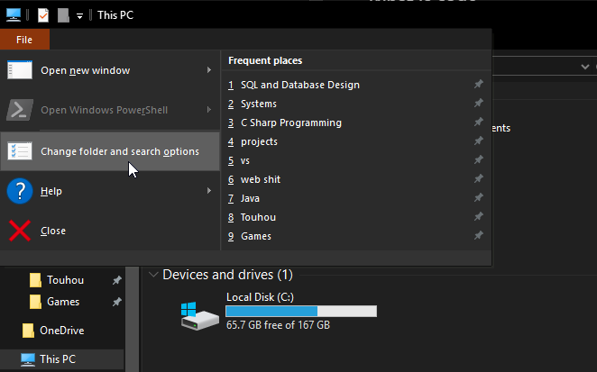
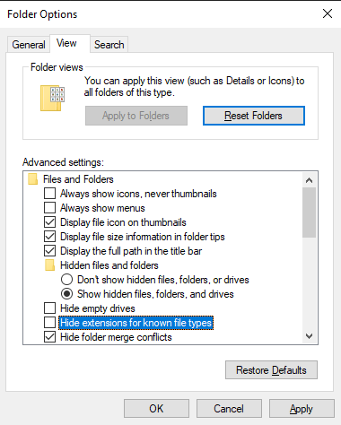
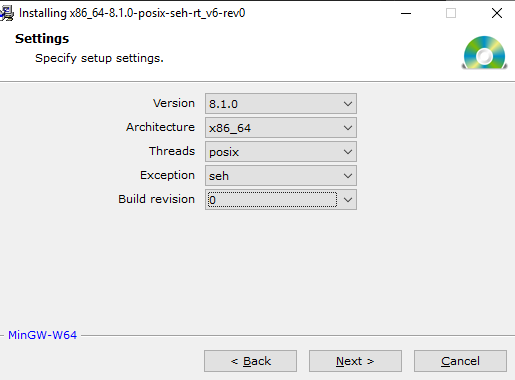
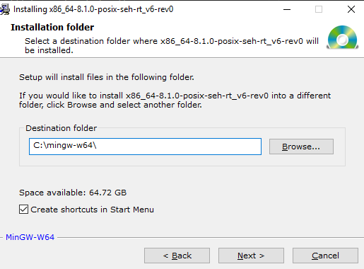
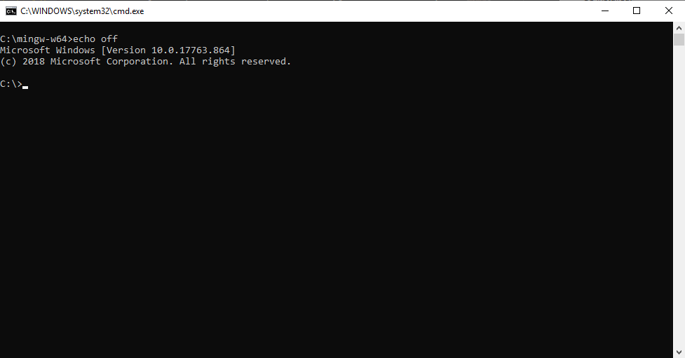

# 0.2 - The Compiler

## What is code

In the previous section, you may have noticed I described VS Code as a text editor, merely a souped up version of Notepad. This is because programming is actually just writing a very fancy plain text file. Don't believe me? Go look at [one of the (many) source files of VS Code itself](https://github.com/microsoft/vscode/blob/master/src/main.js). Those colors aren't fancy Microsoft word formatting, they're added by GitHub to help make the text more readable.

Since code is just plain text, we're going to need a way to differenciate between code written in different languages. We do that by changing the **file extension**. A file extension is just a special part of a file's name that tells Windows what type of file it is. By default, Windows doesn't show us this file extension, so we have to change that.

> If you've already turned on your file extensions in Windows Explorer, you can skip the next part.

Open your File Explorer. Then click on **File** in the top left, followed by **Change folder and search options**.

This will pop up a small dialog window. Click on the **View** tab at the top. Then, in the list below, find **Hide extensions for known file types** and uncheck it. Click **OK**.

That was the housekeeping. Lets actually set up our compiler now.

## Mingw-w64

Our compiler is a program called Mingw-w64. If that's a bit of a mouthful, it's because the program is a bit of a mouthful. Mingw-w64 is an updated version of the original MinGW project, which is a Windows port of the GNU Compiler Collection for Linux, which is the actual compiler that we'll end up using.

Head to the [MinGW-w64 project SourceForge page](https://sourceforge.net/projects/mingw-w64/files/), scroll down a bit and download the **MinGW-W64 Online Installer**. Once downloaded, open it. Hit next, then you'll be confronted with some confusing menu options. Make sure you've got the same options selected as this image, then press Next.

Next it will ask where you want to install the files. The default path is really long and awful, so I would recommend replacing the entire thing with simply `C:\mingw-w64\`

You can leave the Start Menu shortcuts on if you want. We won't be using them.

## Testing the compiler

Now that we've installed that, we need to make sure it works. Open File Explorer, switch to This PC if you haven't already, and navigate to C:\mingw-w64 (or wherever you installed it), then open the `mingw-w64.bat` file that should be there. This will open up a scary black box that you commonly see in hacker movies.

No need to fear, we'll learn how to conquer the spooky monolith in the next page. In the meantime though, you just need to type `gcc -v` and press enter.

If you got a big pile of random garbage that ends with

`gcc version 8.1.0 (x86_64-posix-seh-rev0, Built by MinGW-W64 project)`

then congrats. You did it. If you got

`'gcc' is not recognized as an internal or external command,
operable program or batch file.`

then I don't know what went wrong, because this should've worked.

## [Next Page](0.3.CommandPrompt)

>### Bonus! What did all the weird settings in the Mingw-w64 installer mean?
>
> - Version
>   - The version of the GCC compiler that will be installed. You generally want the latest one.
> - Architecture
>   - Whether you'll be compiling 32-bit or 64-bit programs. There's no reason to compile 32-bit for a desktop computer these days.
> - Threads
>   - Basically decides what multithreading mode the compiler will build your program with. GCC's win32 (Windows) thread implementation is incomplete, which prevents you from using certain features. Mingw-w64 contains an implementation that provides the complete functionality of GCC's Linux threads, which it can use to enable those features.
>   - For a much better explanation than my watered down one, check [this StackOverflow answer](https://stackoverflow.com/questions/17242516/mingw-w64-threads-posix-vs-win32). I basically just rephrased it, since I don't really have much knowledge on the matter.
> - Exception
>   - Similar to threads in there's a couple implementations for exception handling that you can use. These ones are all complete, but the difference is in the performance and what platforms they support.
>   - |Type  |Platform Support  |Speed    |
>     |------|------------------|---------|
>     |SJLJ  |32-bit / 64-bit   |Less Fast|
>     |DWARF |32-bit            |Fast     |
>     |SEH   |64-bit            |Fast     |
>   - I once again refer you to [this StackOverflow answer](https://stackoverflow.com/questions/15670169/what-is-difference-between-sjlj-vs-dwarf-vs-seh) where I took this answer from.
> - Build Revision
>   - Just an extra update option.
